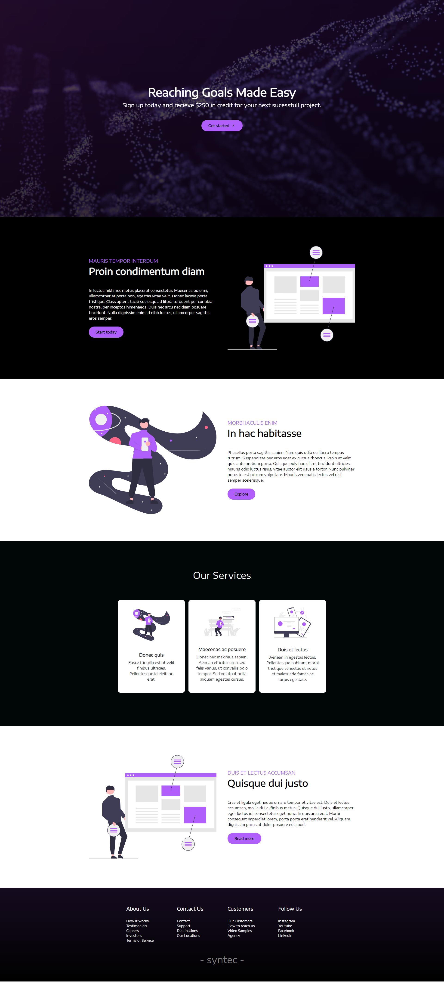
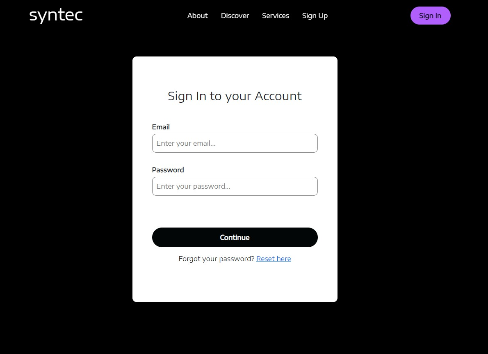
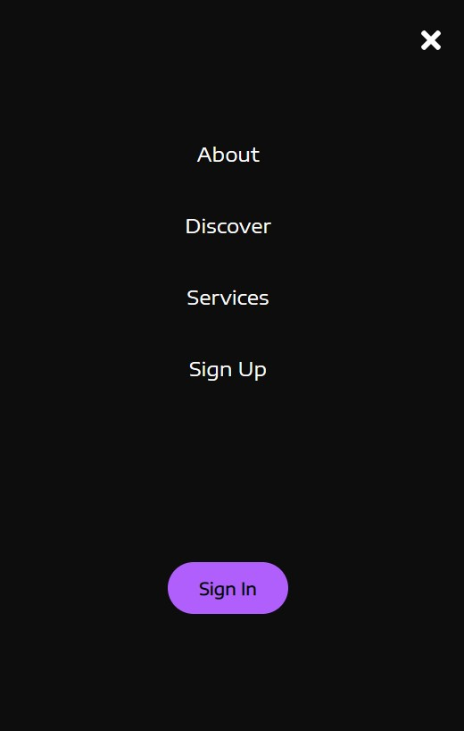

# Company Website built with React

## Overview

Modern responsive company website built with ReactJS and Bootstrap.

## Live Demo

## Setup

1. Clone this repository

```
    https://github.com/marjunmakinano2020/react-modern-company-website.git
```

2. Install packages

```
    cd react-modern-company-website
    yarn install
```

3. Run

```
    yarn start
```


## Tools Used

- Visual Studio Code
- React 17.0.2
- Bootstrap 5


## Resources

- [YouTube - Web Dev Simplified](https://www.youtube.com/c/WebDevSimplified)
- [unDraw Illustrations](https://undraw.co/illustrations)
- [Google Fonts](https://fonts.google.com/)


## Screenshots




